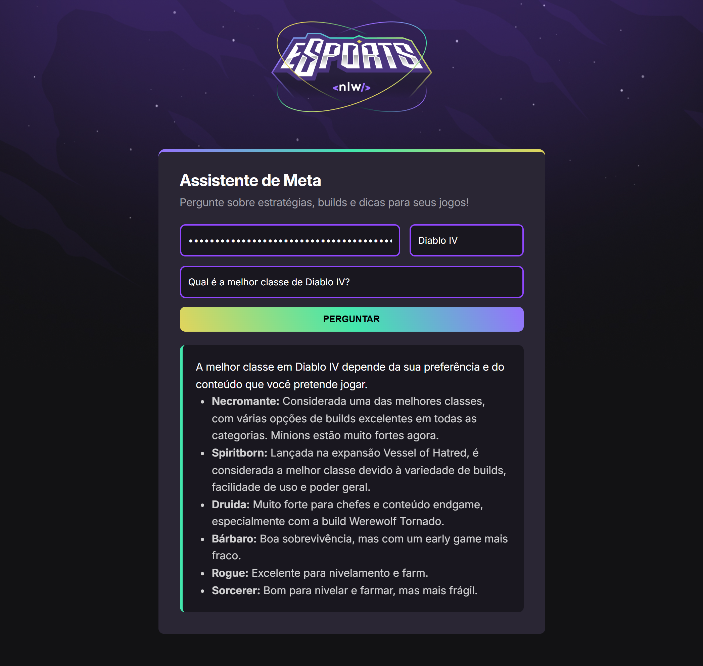

# Assistente de IA

**Assistente de IA** que atua como **especialista em jogos**, fornecendo dicas e estratégias através da **API do Gemini**.

Este projeto foi originalmente criado em HTML, CSS e JavaScript puro durante o **NLW Agents da Rocketseat**. Para fins de aprendizado e aprimoramento das minhas habilidades, migrei o projeto para **React**, aplicando conceitos como componentização e gerenciamento de estado.

## Pré-visualização

## Funcionalidades

- **Integração com Gemini API:** Conecta-se diretamente com a API do Google Gemini para gerar respostas inteligentes e contextuais.
- **Assistente Especializado:** Utiliza prompts customizados para que a IA atue como uma especialista de cada jogo selecionado.
- **Suporte a Múltiplos Jogos:** Oferece um seletor com diversos jogos populares, como Valorant, League of Legends, CS2, entre outros.
- **Formato de Resposta:** As respostas da IA são formatadas em Markdown e renderizadas diretamente na interface, garantindo uma leitura clara e organizada.
- **Interface Reativa:** Construído com React e hooks (`useState`), o que proporciona uma experiência de usuário fluida e dinâmica sem recarregar a página.

## Tecnologias

- React
- JavaScript
- Vite
- HTML5 & CSS3
